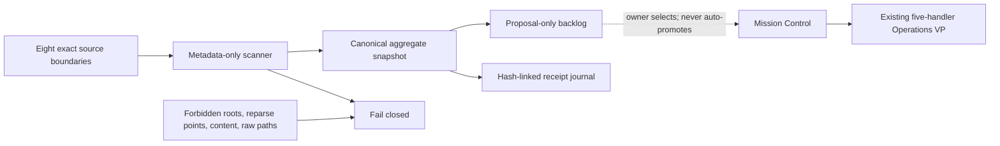

# ARKO-95 Local AI Agency

## Outcome

The agency converts a small, explicit set of local source boundaries into one inspectable catalog and a proposal-only work backlog. It gives Mission Control a truthful map of what is available without turning scattered data into authority.



The agency is not a new model, connector, sensor, generic executor, or fourteenth tool. Mission Control remains the mission authority; Operations VP remains the only unattended execution lane; Decision Learning remains shadow-only. Agency proposals have no lifecycle beyond regeneration and cannot create or advance a mission.

## Crew contract

| Lane | Responsibility | Authority |
|---|---|---|
| Agency director | Surface priorities to the owner | None; the owner remains outside the agency |
| Data cartographer | Measure allowlisted filesystem metadata | Read-only metadata |
| Memory librarian | Build the canonical aggregate snapshot | Agency-state writes only |
| Workflow operator | Compile evidence-linked proposals | Proposal only |
| Proof auditor | Verify policy, boundaries, outputs, and receipt chain | Reject only |

These are responsibility labels, not five continuously running agents. No lane may write source data or approve work. A proposal cannot approve itself or become an Operations duty automatically.

## Source map

`config/agency.json` declares eight source IDs: this ARKO workspace, the shallow Codex project index, five exact OnenessSystem code/configuration/documentation/test roots, and `SecondBrain\0-Inbox`. The scanner applies per-source depth and file caps as well as a 45-second cycle cap.

The following user-profile roots are runtime-denied: the RSB legal case, `.ssh`, `.gnupg`, `.codex`, Downloads, AppData, Personal Vault, and anything reached through a reparse point. A configured source that crosses one of those boundaries is recorded as unavailable; the scanner does not weaken the boundary to obtain a larger count.

## Data minimization

The canonical aggregate snapshot stores:

- stable source IDs and SHA-256 hashes of source-root identities;
- availability, denial, truncation, directory, file, logical-byte, and stale-file counts;
- bounded fixed extension-category counts and same-size/category duplicate candidates;
- typed error categories and proposal evidence.

It does not store raw root paths, child paths, file names, raw extension labels, file contents, content hashes, credentials, browser profiles, or legal-source metadata. Same-size/category groups are review candidates, not proof that files are duplicates.

## Commands

```powershell
# Foreground metadata refresh
pwsh -NoLogo -NoProfile -File .\scripts\Invoke-ARKO95Agency.ps1 -Action Scan

# Read-only views
pwsh -NoLogo -NoProfile -File .\scripts\Invoke-ARKO95Agency.ps1 -Action Status
pwsh -NoLogo -NoProfile -File .\scripts\Invoke-ARKO95Agency.ps1 -Action Backlog
pwsh -NoLogo -NoProfile -File .\scripts\Invoke-ARKO95Agency.ps1 -Action VerifyChain

# Explicit one-time removal of legacy agency-generated snapshots with raw labels
pwsh -NoLogo -NoProfile -File .\scripts\Invoke-ARKO95Agency.ps1 -Action MigratePrivacy -AcknowledgeGeneratedSnapshotRemoval
```

Mission Control exposes the same scan as **Refresh agency map**. It is a foreground owner action, not a scheduled Operations capability. There is no active Agency scheduler or scan interval.

## State and integrity

Agency-owned state is under `state/agency`:

- `latest-catalog.json` — disposable current catalog;
- `latest-backlog.json` — current inert proposals;
- `snapshots/` — scan snapshots; a legacy raw-label snapshot can be removed only by the explicit audited privacy migration;
- `events.jsonl` — append-only scan receipts;
- `chain-head.json` — current receipt checkpoint.

Verification checks the event links, head, and hashes of the latest catalog, backlog, and policy. It detects ordinary edits and clean tail truncation against the checkpoint. It is not an external transparency service: a malicious same-user process that can rewrite the entire journal and checkpoint remains outside the guarantee.

Privacy migration refuses to run unless the current catalog is already a hardened content-free, path-free snapshot containing only fixed extension categories. It can then delete older agency-generated raw-label snapshots and append their hashes to a linked migration event; it never edits a source root.

## Current production baseline

The hardened production refresh on 2026-09-24 admitted two of eight configured roots, counted 44 files and 501,124 logical bytes, and created six `verify_source_boundary` proposals. Six intended OneDrive roots were denied because a source or ancestor is a reparse point. That is a safe hold, not a claim that the data is absent. A following privacy migration removed two pre-hardening agency-generated snapshots, retained their SHA-256 hashes in a linked migration event, and changed no source data.

## Why it is not background yet

The existing current-user project files and state do not have a strong independent code-signing or write-protection boundary. Scheduling the cataloger would let any same-user mutation alter what the scheduled process loads. Agency refresh therefore stays foreground-triggered. Promotion to unattended execution requires a separately verified code identity, protected configuration/state ownership, installation attestation, and new adversarial tests.

## Verification

```powershell
pwsh -NoLogo -NoProfile -File .\tests\Test-Agency.ps1
pwsh -NoLogo -NoProfile -STA -File .\tests\Test-ARKO95.ps1
pwsh -NoLogo -NoProfile -File .\tests\Test-MissionControl.ps1
```

The fixture proves content-free operation, no raw-path persistence, source immutability, legal-working-directory isolation, reparse refusal, path-escape rejection, proposal-only outputs, zero crew approval authority, and receipt-tail truncation detection.
