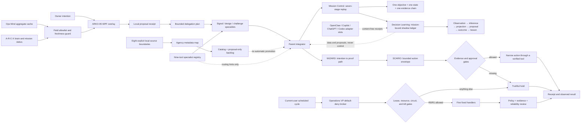

# ARKO-95 architecture

## Outcome

ARKO-95 is a **Partnered Evolutionary Twin**: a bounded co-creator beside the owner. “Evolution” means verified, owner-approved lessons. “Twin” means an inspectable mirror of stated intention—not the owner's legal identity, private thoughts, consciousness, accounts, or authority.

## Runtime split

| Layer | Current implementation | Authority |
|---|---|---|
| Visual pet | Codex v2 8×11 sprite atlas | None; status surface only |
| Desktop presence | PowerShell 7.6.6 + native WPF transparent/topmost window | Local display and local proposal staging |
| Status adapter | Direct file reads with size, reparse-point, field, and freshness bounds | R0 observation only |
| Intention queue | Append-only JSONL receipts inside this project | Proposal only |
| Delegation planner | Deterministic mode-to-roster mapping; up to three read-only specialists | Analysis plan only; no spawning or execution |
| Specialist toolbelt | Nine connector/app entries, specialist mappings, point-in-time readiness notes, hard denials, and registry digest | Proposal-only routing hints; no auto-invocation and no Operations VP eligibility |
| Parent integration gate | Requirements, architecture, writes, conflict resolution, validation, and final judgment | Parent-owned; consequential action still requires separate approval |
| Local AI Agency | Metadata-only scan of eight explicit roots, hash-linked aggregate snapshot, and inert backlog | None; foreground refresh and proposal-only output |
| Cognitive route | A-R-C-X mission plus WIZARD → SCARIO handoff | Classification and planning; no implied execution |
| Operations VP | Five code-fixed R0/R1 handlers, revocable lease, single-worker lock, resource guard, circuit breaker, and hash-linked receipts | Optional current-user scheduled execution inside `state/operations`; default deny |
| Review team | Policy sentinel, evidence auditor, reliability tester | Postcondition checks only; cannot expand authority or reset the kill latch |
| Mission Control | Seven adjacent stages, one-open-mission mutex, expected-version checks, replayed projection, linked subsystem receipts | Coordinates existing planning and five-handler execution; UI and adapters have no stage or approval authority |
| OpenClaw adapter | Redacted connection/model/response-event observation | Proposal and status only; no mission events, execution, approval, credentials, or kill control |
| Decision Learning Fabric | Mission-bound hash-linked data ledger, disposable projection, six typed record lanes, and a 25% exploration ceiling | Shadow analysis only; no mission transitions, execution, approval, policy change, or automatic memory promotion |
| Four-slot AI fabric | OpenClaw, Copilot, ChatGPT, and Codex declarations plus expiring content-free observation receipts | Status/proposal metadata only; installed/running does not prove authentication or interoperability |

## Why WPF

This PC already has a verified WPF runtime in PowerShell 7.6.6. Electron and the managed WebView2 SDK are absent. WPF provides the transparent topmost window, sprite cropping, local telemetry display, and event handling without downloading or installing another framework.

## Safe source boundary

`config/integration-sources.json` is the declarative allowlist. The shell reads only:

- A-R-C-X focus, revision, mission status, and risk tier;
- Operations Mind aggregate health and freshness;
- coarse, non-identifying PC capacity values.

It does not read exact window titles, process names, browser history, legal files, credentials, device serials, MachineGuid, or the raw private mythic profile. Retrieved strings are display data and can never become commands.

## OnenessSystem decision

The current OnenessSystem remains a useful design and read-only status substrate, not a live execution kernel. ARKO-95 intentionally does not bind to its HTTP surfaces because they are not suitable as a current-user authenticated action boundary. Its fixture-only approval objects are not represented as real human approval.

Future in-process planning may use these pure or preview-only interfaces after separate tests:

- `src/net95x/pulse_decode.py::decode`
- `src/subagents/team_router.py::TeamRouter.route`
- `src/network95_kernel/safety.py::SafeActionBroker.preview`

No execute method is enabled in the hatch phase.

## Operations VP boundary

The operator does not translate prose into shell commands. It accepts only exact capability identifiers compiled into `Arko95.Operations.psm1`. Configuration can narrow the list, but cannot supply executable text or add a handler. Each completed duty must pass the three-review postcondition gate, retain parent final judgment, and append a linked receipt.

The separate `config/connector-registry.json` cannot feed this broker. It records only specialist routing metadata for Data Analytics, Investigations, Windows Security, Conductor, Cactus, Plugin Management, NVIDIA Skills, Google Drive, and MagicPath. The parent must verify the live tool, account or tenant, scope, revision, and approval before each connector call. See `TOOLBELT.md`.

The owner can revoke the active lease with the red **STOP OPS** control or the CLI. Any invalid receipt chain, interrupted claim, failed handler, adverse review, expired authority, or resource failure produces a truthful hold or opens the circuit. The owner grant hard-expires after 24 hours and healthy cycles cannot slide that deadline. Re-enabling requires the exact acknowledgement in a foreground terminal. See `OPERATIONS_VP.md`.

## Agency boundary

`config/agency.json` is a separate catalog policy. The scanner does not read file contents, persist raw file names or paths, follow reparse points, traverse the RSB legal case, or convert discovered data into commands. Its only writes are catalog, backlog, snapshot, and receipt files below `state/agency`. The Mission Control refresh button invokes it in the foreground; it is deliberately absent from the Operations VP handler switch. See `AGENCY.md`.

`config/integration-sources.json` separately governs the compact overlay's narrow status reads. Agency outputs do not feed Mission Control events, Decision Learning records, delegation routing, the unified tool index, or Operations VP automatically.

## Evolution gates

1. **Hatch** — visual identity, read-only status, local proposal receipts.
2. **Companion** — deterministic intent decoding and help-only routing with held-out tests.
3. **Operator** — the five local R0/R1 capabilities in `config/operations-vp.json`; consequential actions remain foreground-approved and unavailable to the automatic broker.

Each gate must pass replay, safety, and recovery checks. A new phase cannot inherit authority merely because the visual identity feels more alive.
