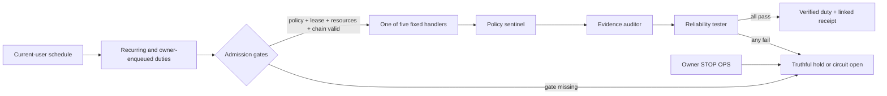

# ARKO-95 WIZARD Operations VP

## Mission

WIZARD is the bounded path from **Work intake** through **Zero-trust admission**, **Audited action**, **Review**, and **Dispatch evidence**. It gives ARKO-95 useful background duties without granting a personality, webpage, worker, or configuration file authority over the PC.

The machine does the repetitive R0/R1 work. A small review team checks results by exception. The owner remains the authority and can stop the operator instantly.

The nine-entry specialist toolbelt in `config/connector-registry.json` is a separate planning surface. Its plugin and application IDs are never copied into this lease or dispatched by this broker; see `TOOLBELT.md`.



## Automatic scope

| Capability | Tier | Effect |
|---|---|---|
| `observe.system_health` | R0 | Reads coarse CPU, free RAM, and disk values; writes a report inside operations state. |
| `audit.receipt_chain` | R0 | Verifies the linked local journal and checkpoint. |
| `verify.delegation_receipt` | R0 | Verifies the latest bounded delegation plan when one exists. |
| `report.operations_brief` | R1 | Summarizes current local operator state into a project-local report. |
| `maintain.operations_workspace` | R1 | Checks and restores only the declared operations directories; it does not delete user content. |

Handlers are selected by a code `switch`. Policy may remove or constrain a capability, but it cannot inject a command, executable, script, or new handler. The broker is default-deny and accepts no free-form parameters in this phase.

## Authority and safety state

- Initialization fails closed: paused, kill latched, circuit open, no active lease.
- Enabling requires the exact acknowledgement `I authorize bounded R0/R1 ARKO-95 operations`.
- A lease is bound to a monotonically increasing policy epoch, hard-expires after at most 24 hours, never renews from a worker cycle, and is limited to 500 completed invocations per UTC day.
- A named mutex permits one worker. Each claim receives a fence token and an idempotent request hash.
- A cycle handles at most three duties and never exceeds the code-defined handlers.
- CPU, RAM, disk, queue depth, lease, kill state, circuit state, and receipt integrity are checked before effects.
- Interrupted work, a changed idempotency request, invalid audit data, a handler failure, or an adverse review fails closed.
- Re-enabling after a stop or fault requires the owner acknowledgement again. Workers and reviewers cannot reset the latch.

`max_attempts` is reserved in policy for a future explicit retry design. This version does not retry a failed handler; it opens the circuit immediately.

## Review team

The review team is deliberately small and non-authoritative:

1. `policy_sentinel` verifies capability, R0/R1 tier, lease epoch, scope, and preflight state.
2. `evidence_auditor` verifies each declared artifact exists within operations state and matches its SHA-256 digest.
3. `reliability_tester` verifies handler result, idempotency key, runtime limit, and postconditions.

All three must pass. They can reject work but cannot approve a new capability, execute a remediation, publish externally, or replace parent final judgment.

## 24/7 schedule

Install a two-minute current-user schedule and enable the bounded lease:

```powershell
pwsh -NoLogo -NoProfile -File .\scripts\Install-ARKO95OperationsVP.ps1 -EnableLowRisk -Acknowledgement 'I authorize bounded R0/R1 ARKO-95 operations' -IntervalMinutes 2
```

The task is named `ARKO95-OperationsVP`, runs as the current interactive user with `RunLevel Limited`, ignores overlapping starts, and has a two-minute execution limit. It invokes one cycle and exits; it is not a privileged service.

The schedule is an availability mechanism, not broader authority. The current policy schedules health every five minutes, receipt audit every ten, delegation verification every fifteen, a brief hourly, and workspace checking every six hours.

The installer does not manufacture the acknowledgement. The owner must provide it explicitly, and the resulting `expires_at` and `absolute_not_after` values must match. An old sliding lease, a missing absolute deadline, or an expired grant fails closed before a handler effect.

The acknowledgement is an explicit-consent gate, not user authentication. The scheduled task loads project-local code and configuration as the current user; a hostile same-user process that can rewrite those files, the complete receipt chain, and its checkpoint is outside this design's trust guarantee. Leave the lease paused unless that account and project directory are trusted. A separately protected installation or signed-code boundary is required before claiming hardened unattended authority.

The Local AI Agency cataloger is not one of the five handlers. It remains a foreground Mission Control action until scheduled code and state have a stronger independent attestation boundary.
STOP OPS governs Operations VP only; it does not cancel a foreground Agency refresh already invoked. The Agency scan has its own 45-second runtime boundary and no background schedule.

## Owner controls

```powershell
# Status
.\scripts\Invoke-ARKO95OperationsVP.ps1 -Action Status

# Queue one exact capability (idempotency key is required)
.\scripts\Invoke-ARKO95OperationsVP.ps1 -Action Enqueue -Capability observe.system_health -IdempotencyKey owner-health-001

# One cycle
.\scripts\Invoke-ARKO95OperationsVP.ps1 -Action Once

# Revoke the lease and latch stop
.\scripts\Invoke-ARKO95OperationsVP.ps1 -Action Stop -Reason owner_stop

# Remove only the schedule; preserve receipts and reports
.\scripts\Install-ARKO95OperationsVP.ps1 -Remove
```

The red **STOP OPS** button in the pet shell performs the same lease revocation and kill-latch action. The visual **Pause aura** button pauses animation only.

## Consequential-action boundary

The automatic operator cannot operate or close other applications; change services, software, registry, firewall, accounts, permissions, or security; access credentials; write outside this project; delete or overwrite user data; publish, push, merge, or release; spend or transfer value; submit legal material; or create/change persistence.

Those categories require a distinct foreground-reviewed workflow. The scheduled-task installer itself is an explicit owner-invoked setup action; the running operator cannot create or modify its own schedule.

## Receipts and recovery

State is stored under `state/operations`, including duty queues, reviews, reports, heartbeat, lease, runtime, control, and `receipts.jsonl`. Each receipt includes the previous digest and a checkpoint records the current head. This catches ordinary edits, truncation, and mismatched checkpoints, but it is not an external transparency log: a malicious same-user process that rewrites both journal and checkpoint is outside this guarantee.

On a resource hold, free PC resources and allow the next scheduled cycle to retry admission. On a fault, inspect `runtime-state.json`, `heartbeat.json`, the held/failed duty, and the receipt-chain result. Do not delete audit state to clear a fault. Resolve the cause, run the tests, and re-enable with the exact owner acknowledgement.

## Verification

```powershell
pwsh -NoLogo -NoProfile -STA -File .\tests\Test-ARKO95.ps1
pwsh -NoLogo -NoProfile -File .\tests\Test-OperationsVP.ps1
```

The adversarial fixture verifies default-closed initialization, acknowledgement gating, handler allowlisting, path confinement, queue idempotency, the three-duty cycle cap, three-review unanimity, receipt tamper detection, automatic kill-latch activation, fixed absolute expiry, absence of sliding renewal, and pre-effect daily-budget rejection.
